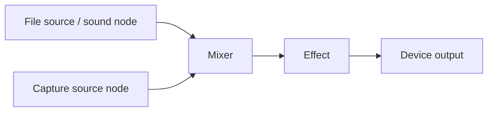

# Architecture

Lindar is one library assembled at build time. `src` provides PCM descriptors and conversion, sources, playback state, rendering, allocation and lifecycle. Modules add graph routing, devices, codecs and processing. A source can be read directly on an MCU or connected to a desktop playback graph through the same public handle.

## Audio model

| Type | Role |
| --- | --- |
| `LND_PCM` | Describes sample storage, format, channels and layout. It has no read position or playback state. |
| `LND_SOURCE` | A stateful PCM reader with an audio format, position and input status. It may read memory, invoke a producer, decode bytes or expose a graph's output. |
| `LND_SOUND` | Playback controls over a source or node: play, pause, loop and gain. With graph support it also supplies rate and channel conversion. |
| `LND_NODE` | A graph element with inputs and outputs, such as a source adapter, mixer, splitter, processor or device endpoint. |
| `LND_RENDERER` | Pulls blocks from a render callback or graph node into application PCM buffers, adapting sample representation and layout. It does not open a device or schedule playback. |

Reading a source advances its position. A sound controls that reader, and its source/node views share the underlying stream state. The graph adapters expose existing sources as nodes and node outputs as sources or sounds. This lets a mixed or processed signal use the same reading and playback interfaces as a decoded file.

Byte IO sits below this model. A file decoder reads encoded bytes through `LND_IO` and supplies PCM through `LND_SOURCE`; a callback or capture source can supply PCM without a decoder. In the other direction, `LND_OUTPUT` encodes PCM to byte IO. Device playback consumes PCM directly and does not use an encoder output.

## Graph and rendering

Connections form a directed acyclic graph. Mixers combine inputs; processors transform their input; splitters provide buffered branches for separate consumers. A typical playback path is:



The arrows show PCM flow. Rendering works backwards: the output requests frames, each node requests the input it needs, and sources read or produce those frames. Mixing, resampling and processing therefore follow demand from the consumer. A mixer can keep time with silence for missing input or wait for its inputs, depending on its policy.

For playback, a device callback drives these requests. For offline processing, the application pulls from a renderer attached to the final node. Without a graph, it can read a source directly or render a sound through the core callback interface. Worker threads can prepare decoded or network input ahead of consumption; they do not replace the pull model.

## Memory and implementation boundaries

Core sources, sounds and renderers support caller-provided storage, allowing a build without an OS or heap. Allocating constructors use the selected allocator: libc or application callbacks. Optional modules and their dependencies have their own storage and execution requirements; selecting an application allocator does not redirect third-party allocations automatically.

Resource handles are opaque. Internally, source and sound operations dispatch to the core implementation or a module implementation; graph adapters are created when needed. Applications use the same C interfaces without depending on those object layouts.

## Modules

An implementation directory declares one globally unique module in `module.cmake`. Category directories contain only subdirectories; nesting does not imply a dependency. Public API stays in `lindar.h` for `src`, or one `lindar_<module>.h` per module that adds declarations.

### Manifests

```cmake
lnd_add_module(stretch
    DEFAULT OFF
    REQUIRES graph
    REQUIRES_PROVIDER stretch_backend
    SOURCES stretch.c
    HEADER lindar_stretch.h
    FREE lnd_stretch_free)
```

The resolver collects declarations, resolves dependencies, then materialises sources. Vendor targets belong in a deferred `SETUP` hook, not manifest collection.

| Declaration | Use |
| --- | --- |
| `REQUIRES` | Unconditional dependency. |
| `DECODER_REQUIRES`, `ENCODER_REQUIRES` | Dependency of an enabled codec direction. |
| `REQUIRES_IF`, `SOURCES_IF` | Conditional `module:dependency` or `module:file` entries. |
| `DEFAULT_WITH`, `INTERNAL` | Default selection and modules selected through dependencies. |
| `OS_MODE`, `THREADS`, `PLATFORM`, `MIN_API`, `AVAILABLE` | Configuration-time requirements. |
| `LANGUAGES`, `SETUP` | Compiler languages and deferred setup. |
| `CONFIG`, `ERRORS`, `FREE` | Registry inputs and lifecycle cleanup. |

The accepted schema is in [cmake/modules.cmake](../cmake/modules.cmake). `ruby tools/check_modules.rb` checks layout and resolution in both declaration orders.

### Keys and providers

Declare keys in `config.def`, defaults in private `config.h`, and exported handles in the module header. Generated table indices are private to a build; no numeric ranges are reserved across modules.

`PROVIDES`, `PROVIDER` and `PROVIDER_KIND` register an implementation descriptor; `REQUIRES_PROVIDER` requires an enabled implementation. The consumer owns selection policy. Device roles are NATIVE, EXTENSION and FALLBACK, alphabetically ordered within each role.

Shared RIFF/MP4/ID3 parsers expose structural parsing, not a common acceptance policy. In particular, metadata rewriting requires complete RIFF structure while playback can accept a truncated final data chunk.
